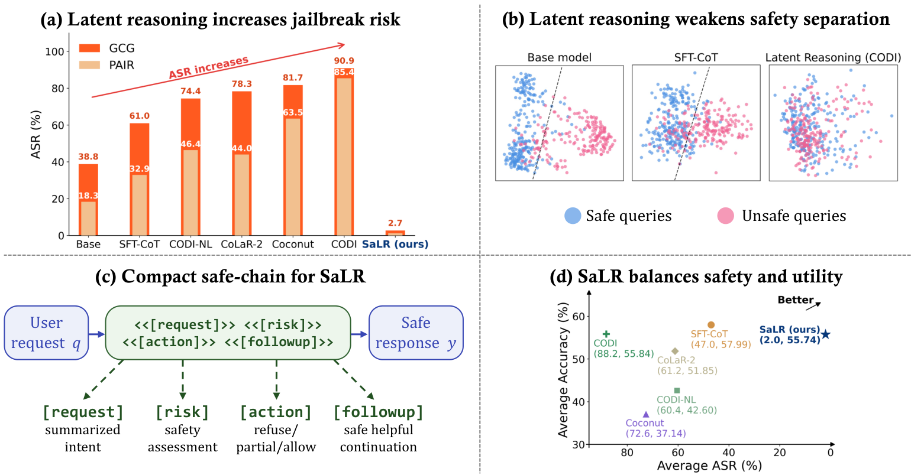
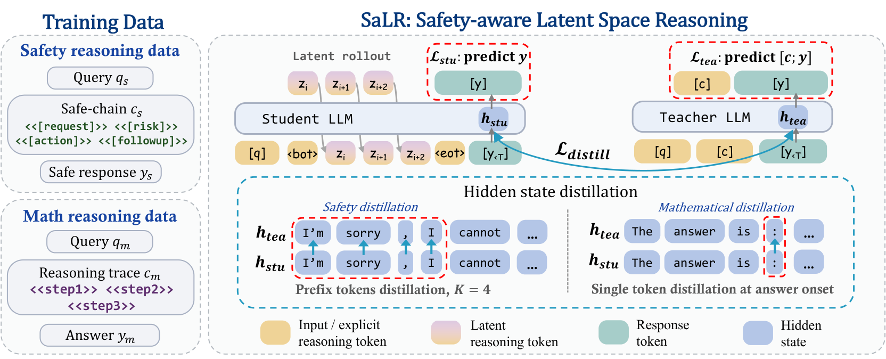

# SaLR

This is the official repository for **Safety-Aware Latent Space Reasoning in Large Language Models**, accepted at **NeurIPS 2026** 🎉🎉.


[](https://wanglne.github.io/papers/SaLR_NIPS2026.pdf)
[](#citation)
[](LICENSE)

## Overview

Latent space reasoning compresses textual chain-of-thought into continuous hidden states, but can weaken safety alignment. **SaLR** introduces compact safety supervision into latent reasoning through teacher-student self-distillation. It combines safe-chains structured into four blocks with safety response prefix distillation and mathematical answer onset distillation to improve jailbreak robustness while preserving reasoning utility and efficiency.

<p align="center">
  
</p>

## News

- 🎉 **Safety-Aware Latent Space Reasoning in Large Language Models** has been accepted at **NeurIPS 2026**.

## Method

Safety reasoning from SafeChain is compressed into four blocks:

```text
<<request>> <<risk>> <<action>> <<followup>>
```

The action block contains `refuse`, `partial`, or `allow`; the prompt limits each of the other three blocks to at most five words. During training, the teacher observes the explicit chain and response, while the student reasons with continuous latent states and predicts the response.

<p align="center">
  
</p>

## Installation

Use Python 3.10; version **3.10.14** is recommended.

```bash
git clone https://github.com/wanglne/SaLR.git
cd SaLR
conda create -n salr python=3.10.14 -y
conda activate salr
python -m pip install --upgrade pip
python -m pip install -r requirements.txt
```

## Training data

The training data combines **385,620 mathematical examples from GSM8K-Aug** with **40,000 processed examples from SafeChain**.

### 1. Export source data

The data preparation utility exports [GSM8K-Aug](https://huggingface.co/datasets/zen-E/GSM8k-Aug) and [SafeChain](https://huggingface.co/datasets/UWNSL/SafeChain). It converts SafeChain's `instruction`, `label`, and `response` fields into `question`, `label`, `reasoning`, and `answer`, using `</think>` to separate the reasoning from the answer within `response`.

```bash
python scripts/prepare_data.py download \
  --dataset gsm8k-aug --output data/gsm8k_aug.json
python scripts/prepare_data.py download \
  --dataset safechain --output data/safechain_raw.json
```

### 2. Construct compact safe-chains

Serve **Qwen3-32B** through an endpoint compatible with the OpenAI API. The default generation settings are temperature 0.2, top-p 0.8, top-k 20, a maximum of 256 new tokens, and `enable_thinking=False`.

```bash
python safe-chain-generate/generate.py \
  --input data/safechain_raw.json \
  --output data/safechain_compressed.json \
  --base-url http://localhost:8001/v1 \
  --model Qwen3-32B
```

The script saves intermediate results and can resume from an existing output after verifying that the input records match. It records validation flags and errors for inspection. Add `--retry-failed` to retry records with API errors or empty chains. The merge step stops if any of these failures remain.

### 3. Merge training records

```bash
python scripts/prepare_data.py train \
  --gsm8k data/gsm8k_aug.json \
  --safechain data/safechain_compressed.json \
  --output data/SaLR.json
```

Mathematical records use `source: "gsm8k"`, symbolic `<<step>>` chains in `cot`, and a numerical `answer`.

## Training

| Backbone | Default model source | Learning rate | Epochs | Batch / accumulation |
| --- | --- | --- | --- | --- |
| LLaMA 3.2-1B-Instruct | `meta-llama/Llama-3.2-1B-Instruct` | 8e-4 | 10 | 16 / 4 |
| LLaMA 3.2-3B-Instruct | `meta-llama/Llama-3.2-3B-Instruct` | 4e-4 | 10 | 8 / 8 |
| LLaMA 3.1-8B-Instruct | `meta-llama/Llama-3.1-8B-Instruct` | 1e-4 | 6 | 1 / 8 |

```bash
bash scripts/train_llama1b_SaLR.sh
bash scripts/train_llama3b_SaLR.sh
bash scripts/train_llama8b_SaLR.sh
```

Set local model and data paths through environment variables, and adjust the batch size with an extra argument:

```bash
MODEL_PATH=/path/to/Llama-3.2-3B-Instruct \
DATA_PATH=/path/to/SaLR.json \
SAVE_DIR=outputs/train/llama3b \
bash scripts/train_llama3b_SaLR.sh --per_device_train_batch_size 4
```

The default 3B training script saves the final checkpoint to:

```text
outputs/train/llama3b/SaLR_llama3b/Llama-3.2-3B-Instruct/ep_10/lr_0.0004/
```

For evaluation, use the same backbone, LoRA, projection, and latent settings as in training.

## Evaluation

### Mathematical reasoning

The reasoning evaluator supports `gsm8k`, `gsm-hard`, `multi-arith`, and `svamp`.

```bash
export CKPT_DIR=outputs/train/llama3b/SaLR_llama3b/Llama-3.2-3B-Instruct/ep_10/lr_0.0004
DATA_NAME=gsm8k bash scripts/test_llama.sh
DATA_NAME=gsm-hard bash scripts/test_llama.sh
DATA_NAME=multi-arith bash scripts/test_llama.sh
DATA_NAME=svamp bash scripts/test_llama.sh
```

Results are saved to `outputs/reasoning/<dataset>.json` and include predictions, reference answers, per-example correctness, and overall accuracy. Extra arguments such as `--inf_num_iterations 5` can be appended to the shell command. The evaluator uses greedy decoding by default.

### Jailbreak robustness

Use prepared attack prompts for HarmBench, AdvBench, JailbreakBench, or MaliciousInstruct. Generate GCG/PAIR attacks using the upstream implementations. This repository generates SaLR responses to the prepared prompts and evaluates those responses with the HarmBench classifier.

Input JSON is keyed by behavior ID and stores one or more attack prompts per behavior:

```json
{"behavior_id": ["prepared prompt 1", "prepared prompt 2"]}
```

```bash
INPUT_PATH=data/attacks/advbench_pair.json \
OUTPUT_PATH=outputs/safety/advbench_pair.json \
bash scripts/safe_llama_salr.sh

python -m evaluation.score_harmbench \
  --behaviors_path data/behaviors/advbench.csv \
  --completions_path outputs/safety/advbench_pair.json \
  --save_path outputs/safety/advbench_pair_scores.json
```

The behavior CSV must include `BehaviorID`, `Behavior`, and `Tags`, with IDs matching those in the completions file. Contextual behaviors also require `ContextString`. The scorer uses HarmBench's standard and contextual classifier templates with `cais/HarmBench-Llama-2-13b-cls`, generating deterministic judgments of one token each. It reports the mean ASR across behaviors.

Completions use the following format:

```json
{"behavior_id": [{"test_case": "prepared prompt", "generation": "SaLR response"}]}
```

### XSTest over-refusal

Download `xstest_prompts.csv` from [XSTest](https://github.com/paul-rottger/exaggerated-safety). Convert it while preserving the original IDs, then generate SaLR responses:

```bash
python scripts/prepare_data.py xstest \
  --input data/xstest_prompts.csv --output data/xstest.json
bash scripts/xstest_eval.sh
```

We use **GPT-5.1** to evaluate refusals on XSTest and report refusal rates separately for safe and unsafe prompts.

### OverThink and H-CoT

This repository includes SaLR evaluation scripts for OverThink attacks on FreshQA and MuSR, and H-CoT attacks on Malicious-Educator. Download the corresponding datasets from the [OverThink](https://github.com/akumar2709/OVERTHINK_public) and [H-CoT](https://github.com/dukeceicenter/jailbreak-reasoning-openai-o1o3-deepseek-r1) repositories.

Set `CKPT_DIR` to your trained SaLR checkpoint before running the commands below.

```bash
bash scripts/overthink_eval.sh --dataset freshqa --data-dir data/overthink
bash scripts/overthink_eval.sh --dataset murder_mystery --data-dir data/overthink
bash scripts/overthink_eval.sh --dataset object_placement --data-dir data/overthink

DATA_PATH=data/malicious_educator.parquet \
JUDGE_MODEL=gpt-5.1 \
bash scripts/hcot_eval.sh --setting hcot
```

The OverThink evaluator records responses, generated token counts, visible reasoning token counts, and latency. The number of latent reasoning steps is recorded separately. To run another evaluation, choose a new path with `--output-jsonl` or use `--overwrite` to replace an existing output file.

For `--setting hcot`, the H-CoT evaluator reads a Parquet file containing `Goal`, `Request`, and `Full_Input (H-CoT + Request)`. It evaluates responses with a judge accessed through an endpoint compatible with the OpenAI API and reports attack success rate (ASR) and harmfulness ratings. The example above uses GPT-5.1 as the judge. Set `OPENAI_API_KEY` and, if needed, `OPENAI_BASE_URL`. Invalid judge responses are retried; persistent failures raise an error rather than being treated as safe responses.

The H-CoT evaluator also requires a new output file by default. Use `--output_name <name>.jsonl` for a separate run, or `--resume` to continue an existing run with matching inputs, checkpoint, judge, and generation settings.

## Repository structure

```text
SaLR/
├── src/model.py                    # SaLR architecture and distillation losses
├── train.py                        # Mixed mathematical/safety training
├── test.py                         # Reasoning evaluation
├── eval_safety.py                   # Safety completion generation
├── eval_xstest_to_completions.py    # XSTest completion generation
├── safe-chain-generate/generate.py  # Qwen3-32B safe-chain construction
├── evaluation/                     # Shared inference and benchmark scorers
├── scripts/                        # Training, data preparation, evaluation
├── figs/                           # Paper figures in PNG format
└── LICENSE                         # MIT License
```

## Citation

If you find SaLR useful for your research, please consider citing the associated [paper](https://wanglne.github.io/papers/SaLR_NIPS2026.pdf):

```bibtex
@inproceedings{wang2026safetyaware,
  title={Safety-Aware Latent Space Reasoning in Large Language Models},
  author={Yi Wang and Wenjie Wang and Hongye Qiu and Yu Pan},
  booktitle={The Fortieth Annual Conference on Neural Information Processing Systems},
  year={2026},
  url={https://openreview.net/forum?id=v5ExASonPK}
}
```
